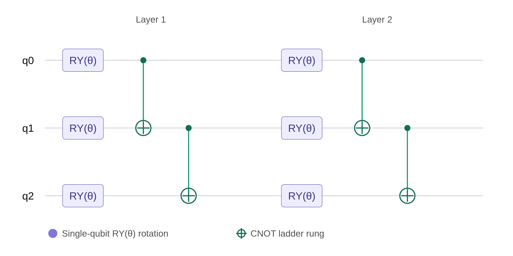

# Compare quantum circuit simulators

You've worked on building your own quantum circuit simulator, which will now be in a more-or-less functional state. I encourage you to keep working on it for the learning outcome. However, there exist of course already a ton of other simulators. 

If you were given the task by a supervisor or employer to start investigating variational quantum circuits, e.g. for quantum chemistry applications, you would at some point want to simulate a wide range of different parametrized circuits. In parametrized circuits, some of the gates are variable, such as the $R_x(\theta), R_y(\theta), R_z(\theta)$ gates. These parameters would typically be optimised by a classical optimiser using outcomes of the quantum circuit as the cost function to be minimised. 

One of the first circuits you might look at could be this _ladder ansatz_ circuit:

If you want to know more about this and related circuits, you can read about it in IBM's documentation [here](https://quantum.cloud.ibm.com/learning/en/courses/variational-algorithm-design/ansaetze-and-variational-forms#n-local-circuits) and [here](https://quantum.cloud.ibm.com/docs/en/api/qiskit/qiskit.circuit.library.n_local) – they call it an _N-local_ circuit. 

You would like to simulate the ladder ansatz above and calculate some properties of the output state. Now, suppose your supervisor/employer knows nothing about quantum computing. Then (s)he would not tell you what quantum simulator framework to use – you'd have to figure it out yourself. Then, when you go searching for a good framework, you'd most likely come across IBM's [Qiskit](https://www.ibm.com/quantum/qiskit) which is probably the most popular. But if you search just a little more, you'll come across multiple other frameworks and packages that look just as capable to do the job. Which to choose?

In this situation, I would suggest you to simply try them all out and see which of them are capable of implementing your task, which of them have the better user experience, which is better documented, which is faster, etc.

So, in this exercise, you should:

1. Pick at least two different quantum simulation frameworks.
2. Read the docs to find out how to set up simple circuits and calculate the state vector $|\psi_f\rangle$ at the end.
3. Implement the circuit illustrated above.
4. Calculate the probability of measuring 000, $P('000') = | \langle \psi_f | 000 \rangle|^2$ and plot as a function of $\theta$. Also, calculate the expectation value of the $Z_1Z_2Z_3$ operator, $\langle Z_1Z_2Z_3 \rangle$ and plot as a function of theta.
5. Compare the output of the two (or more) simulators: Did you get the same?
6. Repeat with other frameworks.
7. Leave a message on the [#quantum-circuit-simulator](https://discord.com/channels/1527267313563205773/1534516124744552638) channel on Discord: Briefly describe your experience with the frameworks you chose. Which did you prefer? What did you like? What frustrated you? 
8. ONLY after you've done points 1-7: If your own simulator is already capable of implementing the ladder ansatz circuit, try to see if you get the same results.
9. ONLY after you've done points 1-7: Try to time the different simulators to see which is faster.
10. ONLY after you've done points 1-7: Play around with the ladder ansatz architecture; add qubits, add layers, change gates, see what happens.

Suggested frameworks to start with:

* [Qiskit](https://www.ibm.com/quantum/qiskit) (IBM)
* [Pennylane](https://pennylane.ai/) (Xanadu)
* [Cirq](https://quantumai.google/cirq) (Google)
* [QuTiP](https://qutip.org) (academic)
* [Qulacs](https://docs.qulacs.org/en/latest/index.html) (academic)
* [qcirsim](https://github.com/neago/sciqis-qcircsim-claude) (a simulator Claude Fable coded for me, taking a few hours and 13$ in credits)