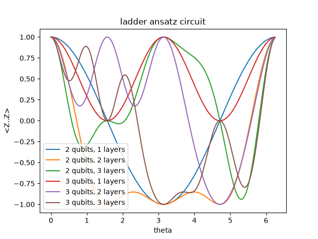

# Improve my plot

_Practice_

Visualising data is a core skill of any scientist. It enables you to explore and understand your data and calculations, and to tell a story about the data to your audience. Apart from static plots, it can also be very useful to use animations or interactive plots to present and explore your data.

Making beautiful AND informative plots or other visualisations is an art form that is very much worth investing some time into practicing. For communication of scientific results, your number one priority should be on conveying a clear and unambigous message that the recipient can understand with as little mental effort as possible. However, this often goes hand-in-hand with making the graphical style look pretty. 

There are a bunch of very nice plotting libraries for Python, also many that do high-quality interactive visualisations. Prominent examples are [Plotly](https://plotly.com/python/), [Bokeh](https://bokeh.org), [Vega-Altair](https://altair-viz.github.io) and [seaborn](https://seaborn.pydata.org). It is fun to play around with these libraries and get inspiration for how to present data in clever, enlightening ways.
Good old [Matplotlib](https://matplotlib.org) is however still the "industry standard" and go-to plotting tool for most scientists working in Python.


Here is a fantastic plot for my thesis/paper that I just made with a few lines of standard matplotlib code,
```python
for i,nq in enumerate(n_qubits):
    for j,nl in enumerate(n_layers):
        print(f'\nLadder ansatz circuit with {nq} qubits and {nl} layers:\n')
        run_ansatz(nq, nl, 0, True)  # purely to visualize circuits
        plt.plot(thetas, ezs[i,j], label=f'{nq} qubits, {nl} layers')
        plt.legend()
plt.title('ladder ansatz circuit')
plt.xlabel('theta')
plt.ylabel('<Z..Z>')
```



Or is it – fantastic? Probably you can make it look cleaner, prettier and more informative. That's your task!

1. Find the plot, the data (stored as `.npy`), a notebook generating the plot above from the `.npy` file, and the script used to generate the raw data in the `improve-my-plots-assets` folder. You don't need to run the script (you can just plot from the stored data), but if you do want to run it, you need to install qcircsim in your environment with `uv add git+https://github.com/neago/sciqis-qcircsim-claude.git`.
2. Create an improved version of the plot. Give it some loving care! Make it as clear and informative as you can, and if you can also make it pretty, that's just a bonus.
3. Now come up with a completely different way of visualising the same data. This could be as an animation, an interactive ipywidget (see [Visualisation.ipynb](../demos/Visualisation.ipynb) as an example on how to do it), or maybe just an entirely different visual style. Feel free to expand on the data-generation script to e.g. plot a wider range of qubit and layer numbers.
4. When you're done with each of the improved visualisations, post it to the [#improved-plot](https://discord.com/channels/1527267313563205773/1534891628798414928) channel, along with a description of what thoughts you had about the design. If you've done an interactive widget or similar, you could perhaps record a screencast of how it works, or otherwise upload the notebook.
5. Optional: Ask your friendly neighbourhood AI to convert your plotting script from 2 and/or the original non-optimal script to Plotly and Bokeh. Does it look nicer? Is the syntax understandable? Would you like to try out those libraries in the future? [personally, I'm more than happy with matplotlib]